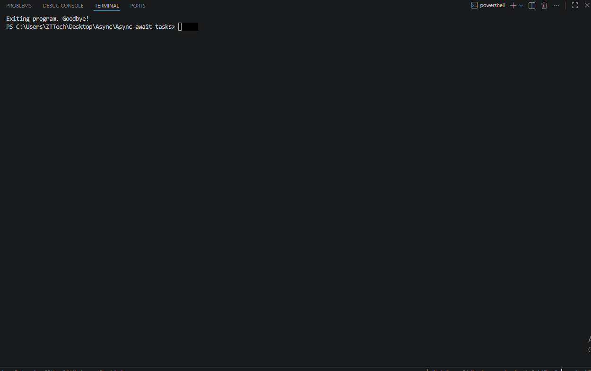

# Asynchronous Tasks Menu

Ushbu loyiha C# dasturlash tilida `Task`, `async` va `await` kalit soʻzlari yordamida koʻp oqimli (multithreading) va asinxron dasturlash asoslarini oʻrganish uchun yaratilgan konsol ilovasidir.

Dasturda foydalanuvchi interfeysi sifatida qulay menyu tizimi tashkil etilgan boʻlib, u `do-while` sikli yordamida boshqariladi.

## 🚀 Loyiha Imkoniyatlari (Menyu)

1. **Breakfast Preparation (Easy)** – Nonushta tayyorlash jarayonini asinxron tarzda simulyatsiya qilish (masalan: choy qoʻyish, nonni qizdirish va bularni bir vaqtda bajarish).
2. **Download Manager** – Bir nechta fayllarni bir vaqtning oʻzida (parallel) yuklab olish jarayonini koʻrsatish.
3. **Student Information System** – Talabalar maʼlumotlarini asinxron bazadan yoki servisdan oʻqib brauzer/ekranga chiqarish.
4. **Fastest Delivery** – Bir nechta kuryerlik xizmatlari ichidan eng tezkorini asinxron aniqlash.
0. **Exit** – Dasturdan xavfsiz chiqish.

## 🛠 Ishlatilgan Texnologiyalar

* **Til:** C# (.NET)
* **Asosiy tushunchalar:** Asynchronous Programming (`async`/`await`), `Task` klassi, Konsol ranglari bilan ishlash, `do-while` sikli.

## Preview



## 💻 Dasturni Ishga Tushirish

Loyiha konsol ilovasi (Console Application) shaklida yozilgan. Uni ishga tushirish uchun quyidagi buyruqlardan foydalanishingiz mumkin:

```bash
# Loyihani yuklab oling yoki klon qiling
git clone <bu-yerga-github-havolangizni-qo'ying>

# Loyiha jildiga kiring
cd AsynchronousTasksMenu

# Dasturni ishga tushiring
dotnet run